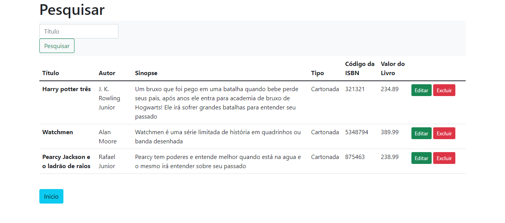

<h1 align="center">
<br>

<br>
<br>
Livraria em PHP
</h1>

<p align="center">
<a href="#sobre">Sobre</a> •
<a href="#tecnologias">Tecnologias</a> •
<a href="#pre-requisitos">Pré Requisitos</a>
</p>

### Features

• [x] Cadastrar Livros <br>
• [x] Editar Livros <br>
• [x] Excluir Livros
# Sobre

<p>
Este projeto foi realizado com a intuição de cadastro, edição e exclusão de livros, foi realizado o desenvolvimento do front-end com os estilos embutidos para que o acesso ao usuario intuitivo e agradavel.
</p>
<br>
<p>
Logo no incio ao abrir o projeto via Web no seu localhost irá verificar o index contendo os botões de redirecionamento, pode-se escolher o cadastro de um novo livro, ou verificar no banco de dados quais já existem a serem verificados
<br>
<br>
<h1  align="center">

</h1>
</p>
<br>
<p>
Para demonstração ilustrada e seguindo a imagem abaixo foi preenchido todos os campos do formulario de cadastro do livro "Watchmen" e apertando no botão em verde "Enviar" o mesmo será cadastrado e habilitado para validação na pesquisa, filtro e disponivel para exclusão e edição desse livro criado
<br>
<br>
<h1  align="center">

</h1>
</p>
<br>
<p>
Apertando no botão "Inicio" volta-se a pagina para escolher a funcionalidade que deseja seja ela cadastrar um novo livro ou validar os existentes, nesse momento o acesso será para verificar os livros existentes na base de dados apertando no boão "Pesquisar Livros" na pagina inicial será redirecionado para a pagina de visualização

Nessa rotina você pode pesquisar e filtrar qual o livro desejado e pode manipular o mesmo se assim desejar tanto quanto excluiu como alterar os dados cadastrais
<br>
<br>
<div align="center" >



</div>
</p>

## Demonstração

<h1 align="center">
<br>

</h1>

# Tecnologias

<p>PHP</p>
<p>CSS</p>
<p>Javascript</p>
<p>MySQL</p>
<p>Bootstrap</p>

# Pre-requisitos

Antes de começar, será necessario instalar em sua máquina as seguintes ferramentas:
[Git](https://git-scm.com), [Wamp](https://www.wampserver.com/en/), ou o [Xampp](https://www.apachefriends.org/pt_br/download.html) para usuarios de Linux. Além disto é aconselhavel que tenha um editor de texto para auxilio no processo de programação como o [VScode](https://code.visualstudio.com)

### Rodando o Front-End

```bash
# Clone este repositorio
$ git clone <https://github.com/Truer-Controller/Livraria.git>

# Após isso abra o serviço do Wamp ou Xampp via aplicativo desktop

# Crie um banco de dados com o nome livraria
CREATE DATABASE livraria;
USE livraria;

# Abra o seu banco de dados MySQL para criar a seguinte tabela
CREATE TABLE livros (
    cod_livro INT(11) not null auto_increment,
    titulo VARCHAR(255),
    autor VARCHAR(255),
    sinopse VARCHAR(500),
    tipo INT(1),
    ISBN INT(50),
    valor float,
    primary key(cod_livro)
);

# Há a necessidade também de criar a tabela de tipo aonde iremos inserir o id do tipo para que quando visualmente o livro seja exibido em tela irá ser visualizado o tipo correto
CREATE TABLE tipo_capa (
    id INT(11) not null auto_increment,
    capa VARCHAR(30),
    primary key(id)
);

```